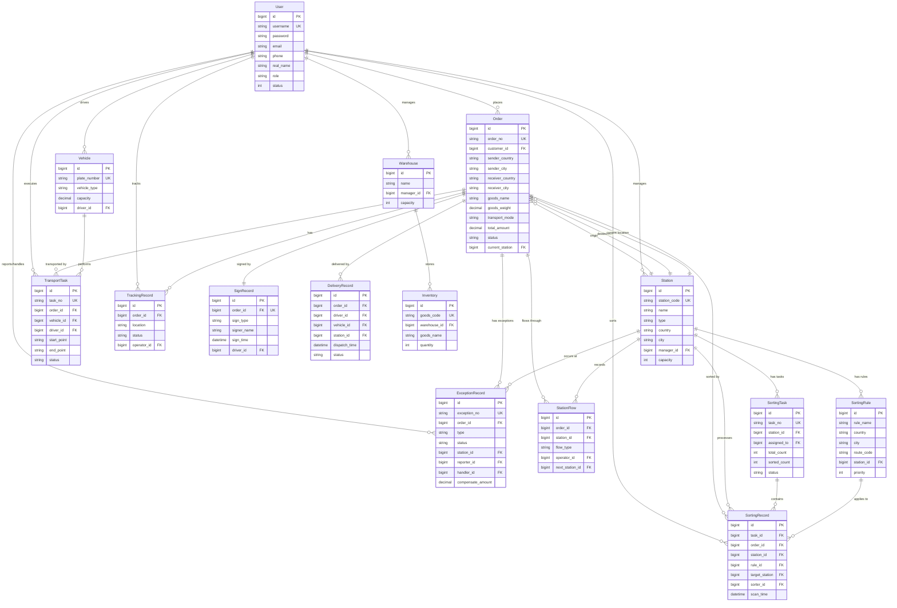

# 跨境物流管理系统 E-R 图

## 实体关系图（文本描述）

### 核心实体及其属性

#### 1. 用户实体 (User)
- 主键：id
- 属性：username, password, email, phone, real_name, role, status
- 角色类型：admin, dispatcher, warehouse, driver, customer

#### 2. 订单实体 (Order)
- 主键：id
- 唯一键：order_no
- 发件信息：sender_name, sender_phone, sender_country, sender_city, sender_address
- 收件信息：receiver_name, receiver_phone, receiver_country, receiver_city, receiver_address
- 货物信息：goods_name, goods_weight, goods_volume, goods_quantity, goods_value
- 运输信息：transport_mode, service_type, estimated_days
- 费用信息：freight_charge, customs_fee, insurance_fee, total_amount, currency
- 状态信息：status, current_station
- 时间信息：order_time, pickup_time, delivery_time, sign_time

#### 3. 站点实体 (Station)
- 主键：id
- 唯一键：station_code
- 属性：name, type, country, province, city, address, latitude, longitude
- 管理信息：manager_id, capacity, contact_name, contact_phone
- 类型：origin(始发站), transit(中转站), destination(目的站), customs(海关站点)

#### 4. 分拣规则实体 (SortingRule)
- 主键：id
- 属性：rule_name, country, province, city, district, route_code
- 关联：station_id(目标站点), priority

#### 5. 分拣任务实体 (SortingTask)
- 主键：id
- 唯一键：task_no
- 属性：station_id, assigned_to, total_count, sorted_count, status
- 时间：start_time, end_time

#### 6. 分拣记录实体 (SortingRecord)
- 主键：id
- 关联：task_id, order_id, station_id, rule_id, target_station, sorter_id
- 属性：route_code, scan_time, is_correct

#### 7. 车辆实体 (Vehicle)
- 主键：id
- 唯一键：plate_number
- 属性：vehicle_type, capacity, driver_id, status

#### 8. 运输任务实体 (TransportTask)
- 主键：id
- 唯一键：task_no
- 关联：order_id, vehicle_id, driver_id
- 属性：start_point, end_point, distance, status, cost
- 时间：start_time, end_time

#### 9. 配送记录实体 (DeliveryRecord)
- 主键：id
- 关联：order_id, driver_id, vehicle_id, station_id
- 属性：dispatch_time, delivery_time, status, fail_reason

#### 10. 签收记录实体 (SignRecord)
- 主键：id
- 唯一关联：order_id (一对一)
- 属性：sign_type, signer_name, signer_phone, sign_time, sign_image
- 位置：latitude, longitude
- 类型：self(本人), proxy(代收), locker(快递柜), station(驿站)

#### 11. 追踪记录实体 (TrackingRecord)
- 主键：id
- 关联：order_id, operator_id
- 属性：location, latitude, longitude, status, description

#### 12. 异常记录实体 (ExceptionRecord)
- 主键：id
- 唯一键：exception_no
- 关联：order_id, station_id, reporter_id, handler_id
- 属性：type, status, description, images, solution, result, compensate_amount
- 时间：report_time, handle_time, close_time
- 类型：damaged, lost, delay, refused, address_err, customs, other

#### 13. 站点流转实体 (StationFlow)
- 主键：id
- 关联：order_id, station_id, operator_id, next_station_id
- 属性：flow_type(in/out), quantity, weight, volume

#### 14. 仓库实体 (Warehouse)
- 主键：id
- 属性：name, address, manager_id, capacity, status

#### 15. 库存实体 (Inventory)
- 主键：id
- 唯一键：goods_code
- 关联：warehouse_id
- 属性：goods_name, quantity, unit, location, min_stock

## 实体关系矩阵

### 一对多关系 (1:N)

| 父实体 | 子实体 | 关系说明 | 外键字段 |
|--------|--------|----------|----------|
| User | Order | 一个客户可以有多个订单 | customer_id |
| User | Station | 一个管理员可以管理多个站点 | manager_id |
| User | Vehicle | 一个司机可以驾驶多辆车 | driver_id |
| User | TransportTask | 一个司机可以执行多个运输任务 | driver_id |
| User | SortingRecord | 一个分拣员可以有多条分拣记录 | sorter_id |
| User | TrackingRecord | 一个操作员可以创建多条追踪记录 | operator_id |
| User | ExceptionRecord | 一个用户可以上报/处理多个异常 | reporter_id/handler_id |
| Order | TrackingRecord | 一个订单有多条追踪记录 | order_id |
| Order | StationFlow | 一个订单有多条站点流转记录 | order_id |
| Order | SortingRecord | 一个订单有多条分拣记录 | order_id |
| Order | TransportTask | 一个订单可以有多个运输任务 | order_id |
| Order | ExceptionRecord | 一个订单可以有多个异常记录 | order_id |
| Order | DeliveryRecord | 一个订单可以有多次配送记录 | order_id |
| Station | StationFlow | 一个站点有多条流转记录 | station_id |
| Station | SortingRule | 一个站点有多条分拣规则 | station_id |
| Station | SortingTask | 一个站点有多个分拣任务 | station_id |
| Station | SortingRecord | 一个站点有多条分拣记录 | station_id |
| Station | ExceptionRecord | 一个站点有多个异常记录 | station_id |
| Station | Order | 一个站点作为始发站/目的站/当前站点 | origin_station_id/dest_station_id/current_station |
| SortingTask | SortingRecord | 一个分拣任务有多条分拣记录 | task_id |
| SortingRule | SortingRecord | 一条分拣规则对应多条分拣记录 | rule_id |
| Vehicle | TransportTask | 一辆车可以执行多个运输任务 | vehicle_id |
| Warehouse | Inventory | 一个仓库有多个库存项 | warehouse_id |

### 一对一关系 (1:1)

| 实体A | 实体B | 关系说明 | 外键字段 |
|-------|-------|----------|----------|
| Order | SignRecord | 一个订单只能有一条签收记录 | order_id (UNIQUE) |

## 关系图（Mermaid格式）

## 数据流向说明

### 订单完整生命周期数据流

1. **下单阶段**
   - User(customer) → Order (创建订单)
   - Order → TrackingRecord (记录"已下单"状态)

2. **揽件入库阶段**
   - Order → Station (分配始发站点)
   - Order → StationFlow (记录入库)
   - Order → TrackingRecord (记录"已入库"状态)

3. **分拣阶段**
   - Station → SortingTask (创建分拣任务)
   - SortingTask + Order → SortingRecord (扫描分拣)
   - SortingRule → SortingRecord (应用分拣规则)
   - Order → TrackingRecord (记录"分拣完成"状态)

4. **运输阶段**
   - Order + Vehicle + User(driver) → TransportTask (创建运输任务)
   - Order → StationFlow (记录出库)
   - Order → TrackingRecord (记录运输节点)

5. **目的地分拣阶段**
   - Order → Station (到达目的站点)
   - Order → StationFlow (记录入库)
   - Order → SortingRecord (目的地分拣)

6. **配送阶段**
   - Order + User(driver) → DeliveryRecord (创建配送记录)
   - Order → TrackingRecord (记录"派送中"状态)

7. **签收阶段**
   - Order → SignRecord (记录签收信息)
   - Order → TrackingRecord (记录"已签收"状态)

8. **异常处理**
   - Order → ExceptionRecord (任何阶段发生异常)
   - User(reporter) → ExceptionRecord (上报异常)
   - User(handler) → ExceptionRecord (处理异常)

## 关键约束说明

### 唯一性约束
- User.username: 用户名唯一
- Order.order_no: 订单号唯一
- Station.station_code: 站点编码唯一
- Vehicle.plate_number: 车牌号唯一
- SignRecord.order_id: 一个订单只能有一条签收记录
- ExceptionRecord.exception_no: 异常单号唯一
- Inventory.goods_code: 货物编码唯一

### 外键约束
- 所有外键字段都建立索引以提高查询性能
- 使用软删除机制，不使用级联删除
- 外键关联使用GORM的foreignKey标签定义

### 业务约束
- 订单状态流转必须按照预定义的状态机进行
- 分拣记录必须关联有效的分拣规则
- 签收记录只能在订单状态为"已送达"后创建
- 异常记录必须有上报人，处理人可以为空（待处理状态）
